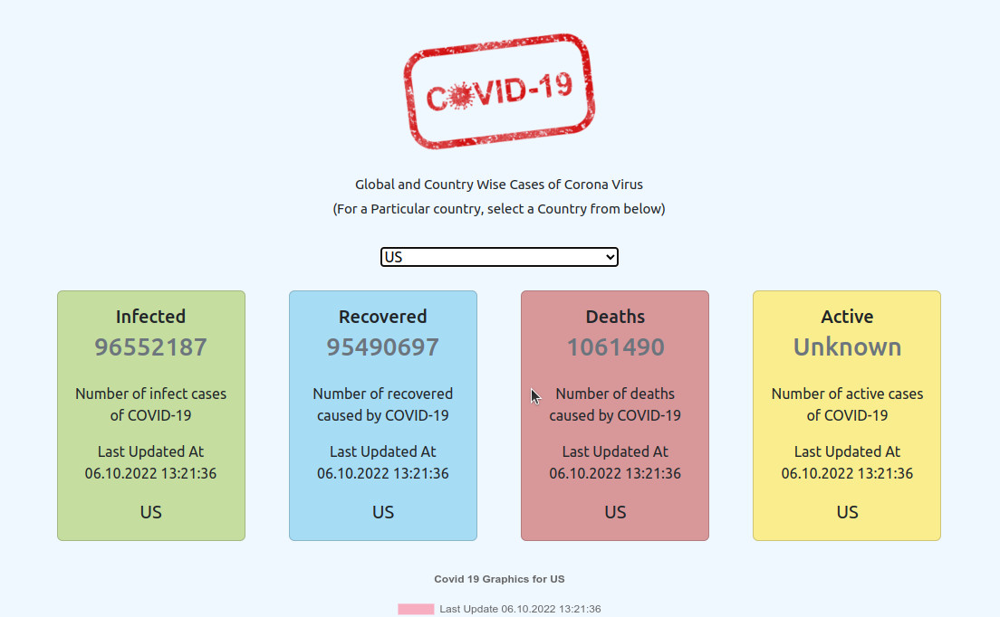

# Covid 19 Tracker

Covid 19 is an application where you can see current patient information. Developed with React JS and Redux.

It gets the data from https://covid19.mathdro.id/api service.


## Demo

You can see [demo](https://tubular-strudel-fa99df.netlify.app/) on Netlify.

  
## Screenshots




  
## Used Rechnologies

- React JS, 
- Redux, 
- Html,
- Css.
  
## Features

React JS, Redux, Html and Css are used in this project. You can see Covid 19 information by the selected country.
  
## API 

All information is provided by https://covid19.mathdro.id/api service. 

```
REACT_APP_API_END_POINT=https://covid19.mathdro.id/api
```

code must add to **.env** file before build this project.
